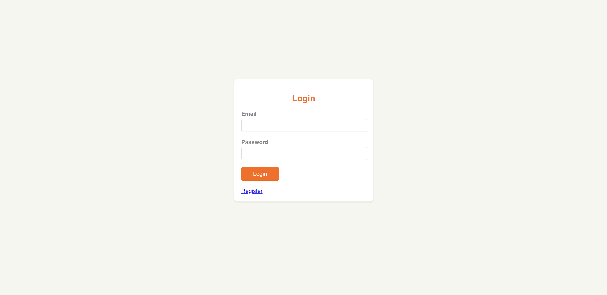
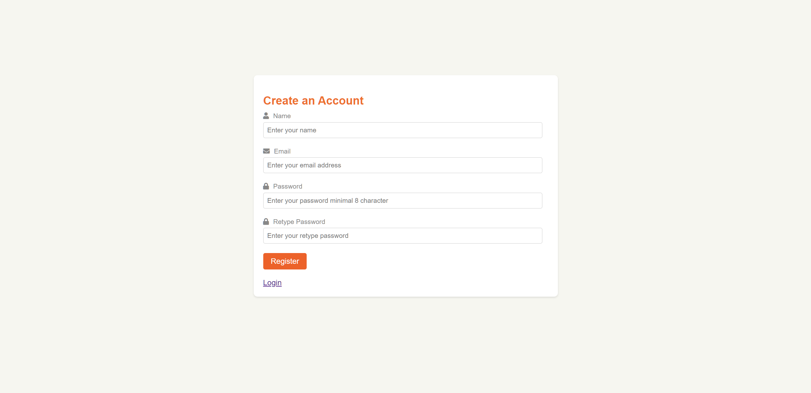
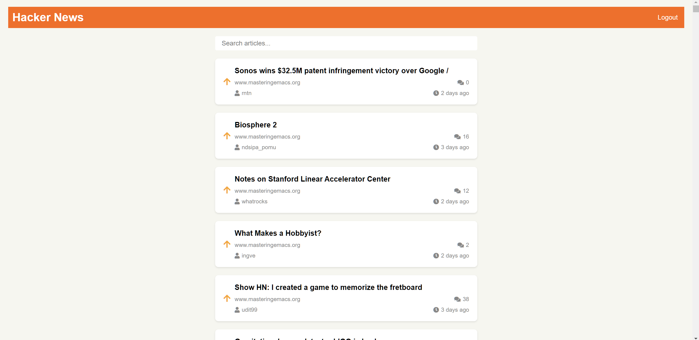
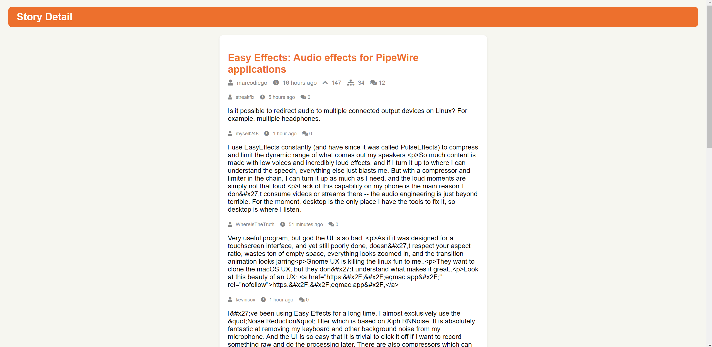

## HackerNews App

The HackerNews App is a web application built with Laravel. It provides a user-friendly interface to browse, read, and interact with news articles from the HackerNews platform. The app utilizes the HackerNews API to fetch and display the latest news stories, along with their associated comments and discussions.

**Access Link: https://fruity-eels-joke-quietly.a276.dcdg.xyz**

**For the HackerNews Service built with Go and explanation, please visit the [HackerNews Service repository](https://github.com/bimaagung/hackernews-service.git).**

### Screenshots

Here are some screenshots of the HackerNews App:

*The login page displays  from HackerNews.*

*The Register page displays  from HackerNews.*

*The home page displays the top news stories from HackerNews.*

*The detail page displays the detail story from HackerNews.*

